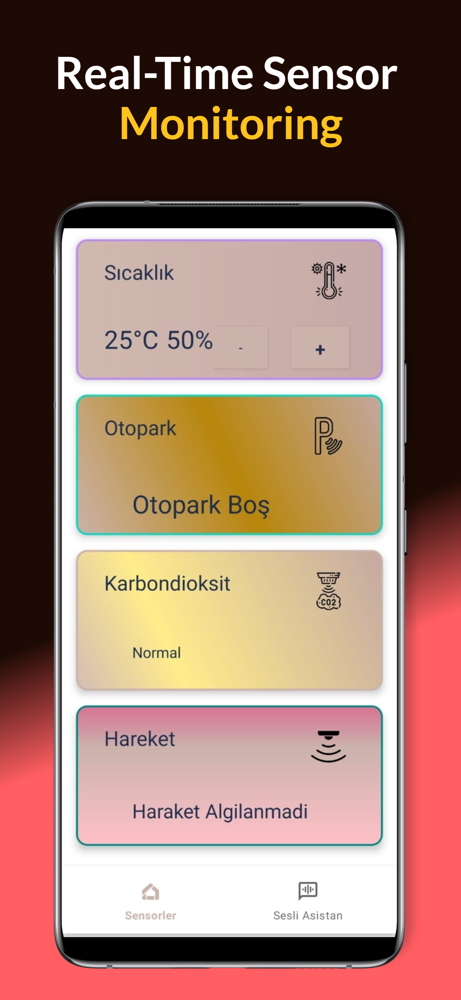
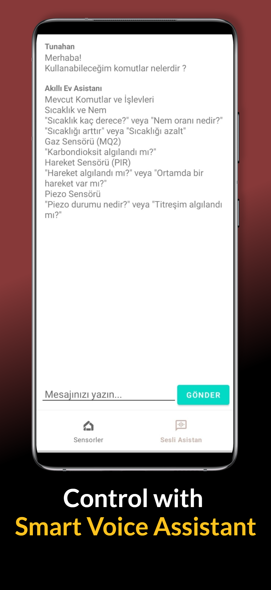

# IoT Sensor Management

This project enables real-time data collection from various sensors (temperature, humidity, motion, gas, piezo) and remote device control using the ESP8266 microcontroller and an Android application.

## Folder Structure

- **android-app/**  
  Contains the Android Studio project. The application is developed in Kotlin and uses OkHttp for data communication.

- **esp8266/**  
  Contains Arduino/C/C++ code running on the ESP8266. This code is responsible for transmitting sensor data to the Android app via HTTP and processing incoming commands.

## Features
- Real-time data collection from various sensors (temperature, humidity, motion, piezo, gas).
- Sending remote control commands (e.g., LED control, temperature adjustment).
- User-friendly interface for monitoring and controlling sensor data within the application.
- Voice assistant integration (currently inactive) and assistance with troubleshooting issues related to the text assistant.
- Support for XML-related error reporting and resolution.

## Technologies Used
- **Android (Kotlin):** Mobile application development.
- **ESP8266:** IoT sensor management and data collection.
- **OkHttp:** Data communication using the HTTP protocol.
- **MVVM:** Structured and maintainable architectural design.
- **Material Design:** Principles for user interface design.

## Setup

### 1. Android Application
- Open the `android-app/` folder in Android Studio.
- Perform the necessary Gradle synchronization.
- Build and run the application on your device or emulator.

### 2. ESP8266 Code
- Open the `.ino` or `.cpp` files located in the `esp8266/` folder using Arduino IDE or PlatformIO.
- Add the required libraries (e.g., WiFi).
- Select your ESP8266 board and upload the code.

## Screenshots

### App Interface

### Sensor Data Display

## Contributing
We welcome feedback via Pull Requests and Issues. Your help is particularly appreciated in the following areas:
- Resolving issues related to the inactivity of the voice assistant.
- Troubleshooting problems with the text assistant.
- Addressing XML-related errors and similar technical issues.

You can also contribute by adding new sensors or improving the code. All suggestions, bug reports, and improvements are highly valued and help enhance the project.

## License
This project is licensed under the MIT License. For details, see [LICENSE](LICENSE).
